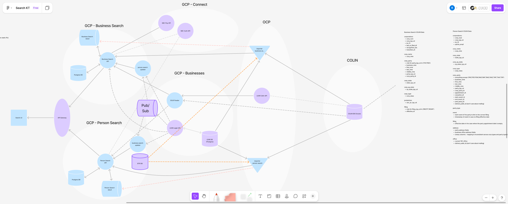
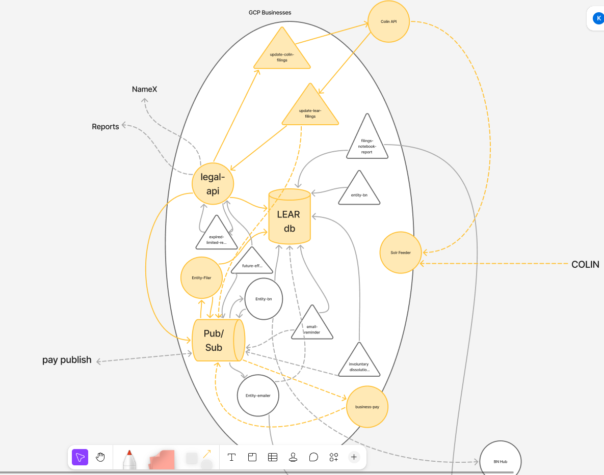
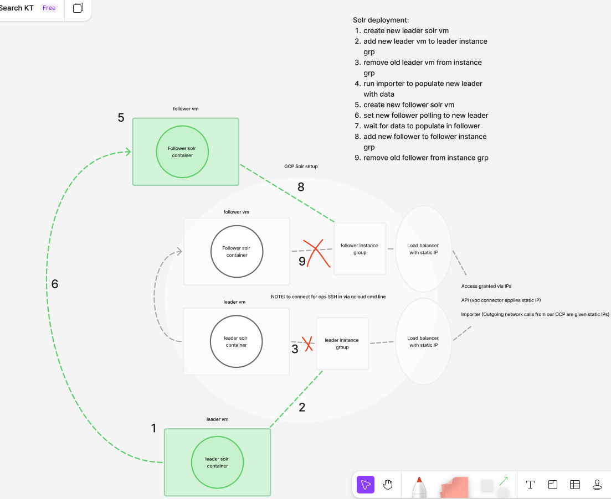

# Search Documentation

#### Overall system and service dependencies

For step by step commands on building the search infrastructure from scratch follow: [Building the BUS-SEARCH GCP environment](http://github.com/bcgov-registries/beneficial-ownership/blob/main/internal/Building%20the%20BUS-SEARCH%20GCP%20environment.md)

#### Lear service dependencies

#### Manual Solr Deployment

For step by step deployment commands follow: [Deploying BUS-SEARCH-SOLR](https://github.com/bcgov-registries/beneficial-ownership/blob/main/internal/Deploying%20BUS-SEARCH-SOLR.md)
